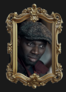
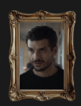

<!-- Classe personnage-assane pour centrer son portrait et mettre le contour en orange -->
## Assane Diop <!-- Classe titreorange pour mettre le titre en orange -->

Maître du déguisement et de la stratégie, Assane s'inspire d'Arsène Lupin pour défier les puissants. Il
agit dans l'ombre, guidé par un passé douloureux.

<!-- Classe personnage-claire centrer son portrait et mettre le contour en orange -->
## Claire {.titreorange} <!-- Classe titreorange pour mettre le titre en orange -->

Ancienne compagne d'Assane et mère de leur fils, Claire est partagée entre l'amour, la lucidité et les
risques que la vie d'Assane implique.

<!-- Classe personnage-youssef pour centrer son portrait et mettre le contour en blanc -->
## Youssef Guedira {.titreblanc} <!-- Classe titreblanc pour mettre le titre en blanc -->

Policier passionné de littérature, il est le seul à reconnaître les références à Lupin. Curieux et
perspicace, il suit une piste que ses collègues ignorent.

<!-- Classe personnage-hubert pour centrer son portrait et mettre le contour en blanc -->
## Hubert Pellegrini {.titreblanc} <!-- Classe titreblanc pour mettre le titre en blanc -->

Homme d'affaires influent, Pellegrini cache de sombres secrets. Il représente un pouvoir prêt à tout pour
se protéger.

